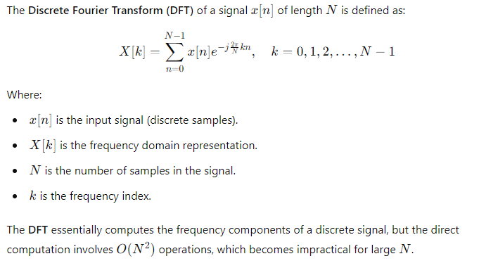
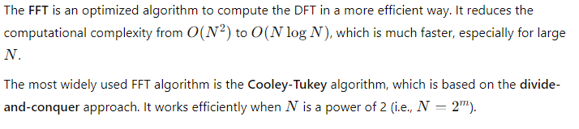
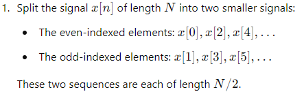
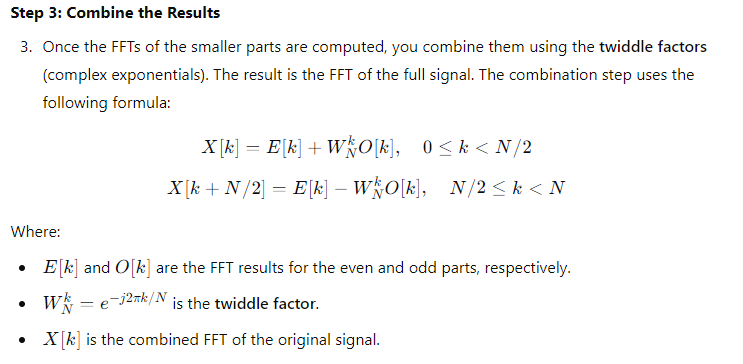
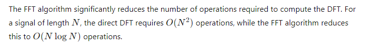
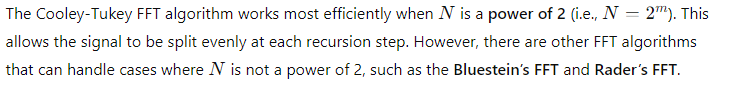
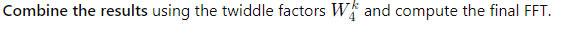

The Fast Fourier Transform (FFT) algorithm is a method to efficiently compute the Discrete Fourier Transform (DFT) of a signal. The DFT itself transforms a discrete-time signal from the time domain into the frequency domain, but calculating the DFT directly can be computationally expensive. The FFT reduces the computational complexity significantly, making it feasible to compute the DFT even for large signals.

1. The DFT and Its Computation

2. The FFT Algorithm: The Key Idea
.

3. Steps of the Cooley-Tukey FFT Algorithm
The basic idea behind the Cooley-Tukey FFT algorithm is to divide the DFT computation into smaller parts and then combine the results. This is achieved by recursively splitting the signal into even and odd-indexed samples, calculating the DFTs of these smaller parts, and then combining them using the symmetry properties of the Fourier transform.

Here’s a step-by-step breakdown of how the FFT works:

Step 1: Divide the Signal

Step 2: Recursively Compute FFT for Even and Odd Parts
Recursively compute the FFT for both the even-indexed and odd-indexed parts. Each recursion breaks down the signal into smaller parts until you reach a length of 1 (the base case).
Step 3: Combine the Results
Once the FFTs of the smaller parts are computed, you combine them using the twiddle factors (complex exponentials). The result is the FFT of the full signal. The combination step uses the following formula:

Step 4: Repeat Recursively
This process continues recursively until the entire signal is transformed into the frequency domain.
4. Computational Complexity

5. The FFT for Power-of-2 Lengths

6. Example: FFT of a Simple Signal
Let’s say we have a discrete signal x[n] of length 𝑁=4
N=4:

x[n]={1,2,3,4}
Divide the signal into even and odd parts:

Even part: 
{1,3}

Odd part: 
{2,4}
Compute the FFT of the even part and the odd part:

FFT of {1,3} gives: E[k]

FFT of {2,4} gives: 
O[k]

